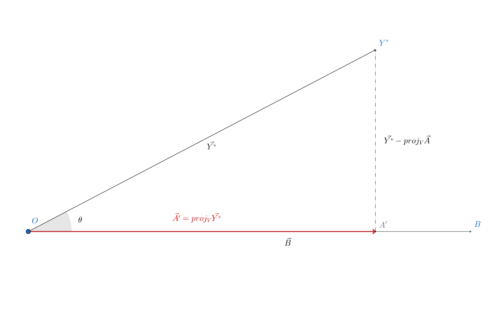

<b style = "font-size:25px">Hồi quy tuyến tính</b> 
<b>Lý thuyết</b>
Giả sử chúng ta có dữ liệu có các cột đầu vào $X_1,X_2,....X_n$ và cột đầu ra $Y$ , kí hiệu $X_i(j)$ là giá trị  hàng $j$ cột $i$ trong bảng dữ liệu  , giả sử dữ liệu có m hàng, ta có : 
$$X_i =  \begin{pmatrix}
 X_i(1)\\
 X_i(2) \\ 
 \vdots\\
 X_i(m)
\end{pmatrix} (1)$$

chúng ta muốn xấp xỉ $Y$ bởi 1 hàm tuyến tính theo các cột đầu vào, giả sử  $Y = b+ \epsilon +\sum_{i=1}^{n} a_iX_i$ , với $\mathbb{E}\left [ \epsilon \right  ] = \bar{\epsilon} = 0$ và phương sai hữu hạn , đặt $L_n$ là vector cột $n$ chiều có tất cả các phần tử bằng $1$  ,ta có 
$$Y-\sum_{i=1}^{n}a_iX_i - bL_{m} = \epsilon$$

 đặt $X = \sum_{i=1}^{n}a_iX_i + bL_{m}$,viết lại dưới dạng ma trận  đặt $U = (X_1,X_2,...X_n,L_m)$ và $v = (a_1,x_2,...a_n,b)$  ,  ta có $X = Uv$ và :
$$ Y-X = \epsilon$$

chúng ta sẽ tìm siêu phẳng $n+1$ chiều sao cho phương sai của $\epsilon$ là nhỏ nhất , ta có:
$$\sigma^2(\epsilon) = \frac{1}{m}\sum_{i=1}^m\epsilon^2(i) = \frac{1}{m}\sum_{i=1}^{n} (Y(i)-\sum_{i=1}^{n}a_iX_i - b)^2 $$
điều nay tương đương với tìm các hệ số $a_1,a_2,...,a_n,b$ sao cho $\frac{\|Y-X\|^2}{m}$ là nhỏ nhất hay $\|Uv-Y \|^2$ nhỏ nhất , dưới góc nhìn hình học , gọi $S$ là không gian sinh bởi các vector $X_1,X_2,...X_n,v_m$ điều này tương đương với tìm vector $X \in S$ sao cho khoảng cách từ $X$ đến $Y$ là nhỏ nhất  

Chúng ta sẽ tìm nghiệm bằng 2 cách là sử dụng gradient descent tìm nghiệm xấp xỉ hoặc tìm nghiệm chính xác bằng cách giải phương trình đạo hàm bằng 0. 
<b>Sử dụng gradient descent </b> 
Trước tiên chúng ta sẽ tính vector gradient của hàm số $f(v) = \frac{\|Uv-Y\|^2}{m}$ ta có : 
$$\nabla f = \frac{2U^T(Uv-Y)}{m}$$
chọn hệ số học $\alpha$ chúng ta sẽ chọn số lần chạy của thuật toán, giả sử chúng ta chạy $L$ lần khi đó chúng ta sẽ tính $v(L)$ bằng cách lặp lại thuật toán $L$ lần:
$$x(t+1) = x(t) - \alpha\frac{2U^T(Ux(t)-Y)}{m} \quad t\in \mathbb{N}$$
<b>Tìm nghiệm chính xác </b>
Chúng ta tìm nghiệm của phương trình đạo hàm bằng 0 , ta có

$$\nabla f = \frac{2U^T(Uv-Y)}{m} = 0 \\
\Leftrightarrow U^T(Uv-Y) = 0 \\
\Leftrightarrow U^TUv = U^TY \\
\Leftrightarrow v = (U^TU)^{-1}U^TY (1)$$
chúng ta chứng minh phương trình có duy nhất 1 nghiệm bằng cách chứng minh $U^TU$  khả nghịch
<b>*Chứng minh $U^TU$ khả nghịch</b>
vì $U$ có các cột độc lập tuyến tính nên $\forall x\in \mathbb{R}^{n+1}$ ta có $Ux = 0 \Leftrightarrow x = 0$ , giả sử $x_0$ thỏa mãn $U^TUx_0=0$ , đặt $Y_0 = Ux_0$ ta có $Y_0 \in U$ và $UY_0 = 0$ , hay $Y_0$ trực giao với các vector cơ sở của $U$ hay $Y_0$ trực giao với $U$ , suy ra $Y_0 \in U^{\perp}$ , suy ra $Y_0 \in U\cap U^{\perp} = \{0\} \Leftrightarrow Y_0 = 0\Leftrightarrow Ux_0 = 0 \Leftrightarrow x_0 = 0 \Rightarrow (U^TUx_0 = 0 \Leftrightarrow x_0 = 0 )$ suy ra $U^TU$  khả nghịch 
<b>Chứng minh $(1)$ là điểm cực tiểu toàn cục </b>
Để chứng minh $(1)$ là điểm cực tiểu toàn cục chúng ta chứng minh bằng 2 cách, 1 cách sử dụng đại số (mang bản sắc hình học), 1 cách sử dụng giải tích lồi. 
<b> Cách ddựa trên đại số</b>

đặt $v_0 = (U^TU)^{-1}U^TY$ chúng ta chứng minh tại đó giá trị của hàm số đạt giá trị nhỏ nhất , với mọi $v\in \mathbb{R}^{n+1} $ đặt  $v = v_1+v_0$ ta có 
$$
\|Uv-Y\|^2 = \|U(v_0+v_1)-Y\|^2 = ||Uv_1 + (Uv_0-Y)||^2
$$
để ý rằng $U^T(Uv_0 - Y)=0$ do đó $Uv-Y$ trực giao với không gian sinh bởi các vector cột của $U$ do đó $Uv_1$ trực giao với $Uv_0-Y$ suy ra 
$$||Uv_1 + (Uv_0-Y)||^2 = \|Uv_1\|^2+ \|Uv_0-Y\|^2 \geq \|Uv_0-Y\|^2 = f(v_0)$$
vậy $f(v) \geq f(v_0)$ đẳng thức xảy ra khi $\|Uv_0\|^2=0 \Leftrightarrow Uv_1 = 0 \Leftrightarrow v_1 =0$  hay $v_0$ là điểm cực tiểu toàn cục duy nhất
<b>Cách dựa trên giải tích lồi</b>
$\forall u_0,u_1 \in \mathbb{R}^{n+1}$ và $\theta \in \left[ 0,1\right]$ , đặt $g(v) =  \sqrt{f(v)} = \|Uv-Y\|$chúng ta có 
$$
g(\theta u_0 + (1-\theta)u_1) = \|U(\theta u_0 + (1-\theta)u_1)-Y\| \\
= \|\theta (Uu_0-Y) + (1-\theta)(Uu_1-Y))\| \\
\leq \|\theta (Uu_0-Y) \| + \|(1-\theta)(Uu_1-Y))\| \\= \theta\|Uu_0-Y\| + (1-\theta)\| Uu_1-Y\|\\
= \theta g(u_0) + (1-\theta)g(u_1) 
$$
như vậy $g$ là 1 hàm lồi suy ra 
$$g(u_2) - g(u_1) \geq \nabla g(u_1)^T(u_2-u_1)$$
chúng ta có $$
\nabla g = \nabla \sqrt{f} = \frac{\nabla f}{2\sqrt{f}}
$$ tại $v = v_0$ ta có $\nabla f(v_0) = 0$ suy ra $\nabla g(v_0) = 0$, với $u_2$ bất kì ta có $$
g(u_2) - g(v_0) \geq \nabla f(v_0)^T(u_2-v_0)\\
\Rightarrow g(u_2) - g(v_0) \geq 0^T(u_2-v_0) = 0\\
\Rightarrow g(u_2) \geq g(v_0)
$$
vậy $v_0$ là điểm cực tiểu toàn cục duy nhất
<b style = "font-size:20px">Kiểm tra sự tương quan tuyến tính</b>

<b>Hình chiếu </b> 
xét $V$ là  1 không gian vector con của $\mathbb{R}^n$ và $u \in \mathbb{R^n}$ ,hình chiếu của $u$ lên $V$ là vector $v\in V$ thỏa mãn $x.(u-v) = 0 \quad  \quad \forall  x\in V (*)$ kí hiệu là $proj_V(u)$
<b>Tính chất : </b> hình chiếu là duy nhất , thật vậy, giả sử $v,v_1 \in V$ thỏa mãn $(*)$ đặt $v_1 = v+v_0 \quad (v_0 \in V)$  ta có $x.(u-v)=0$ và $x.(u-v_1)=0$ hay $x.(v-v_1)=0$ tương đương với $x.v_0 = 0$ hay $v_0 \in V^{\perp}$ mà $v_0 \in V$ suy ra $v\in V\cap V^{\perp} = \{0\}$ hay $v_0 = 0$ suy ra $v_1 = v$ suy ra dpcm  

<b> Tính hình chiếu  </b>  
gọi $v_1,v_2,...,v_m \in \mathbb{R}^n$ là cơ sở của không gian vector $V$ , và $u \in \mathbb{R}^n$ chúng ta cần tính hình chiếu của $u$ lên $V$ , đặt $S = (v_1,v_2,...v_m)$ là ma trận có các cột là các vector $v_1,v_2,..v_m$ , khi đó mọi vector trong $V$ có dạng $S x$ với $x \in \mathbb{R}^m$  , khi đó hình chiếu của $u$ lên $V$ thỏa mãn 
$$S^T(Sx-u) = 0   \Leftrightarrow  S^TSx= S^Tu  \Leftrightarrow  x = (S^TS)^{-1}S^Tu \quad (2)$$ 
hay $Sx = S(S^TS)^{-1}S^Tu$
vậy ma trận chiếu 1 vector lên $V$ là $S(S^TS)^{-1}S^T$  
Để ý rằng nghiệm của bài toán hồi quy tuyến tính chính là hình chiếu của $Y$ lên không gian vector sinh bởi các vector cột đầu vào 

Chúng ta cần 1 cơ sở để kiểm tra xem liệu mô hình hồi quy tuyến tính có phù hợp không, giả sử khi dữ liệu không có nhiễu khi đó $Y = \sum_{i=1}^{n}a_iX_i + bL_m (3)$ , vì $v_m$ là cột có tất cả các hàng đều bằng nhau nên chúng ta sẽ bỏ qua nó , trong $(3)$ lấy trung bình cả 2 vế ta có $\bar{Y} = \sum_{i=1}^{n}a_i\bar{X_i} + b$ hay $$\bar{Y}L_m = \sum_{i=1}^{n}a_i\bar{X_i}L_m + b.L_m \Leftrightarrow Y - L_m\bar{Y} = \sum_{i=1}^{n}(a_iX_i-a_i\bar{X_i}L_m) + b.L_m-b.L_m$$ hay $Y - \bar{Y}L_m = \sum_{i=1}^{n}(a_iX_i-a_i\bar{X_i}L_m)$   với mọi $x \in R^m$ đặt $x^{*} = x-\bar{x}L_m$ ta có $Y^{*} = \sum_{i=1}^n a_iX_{i}^{*}$ , trong thực tế dữ liệu luôn có  nhiễu nên $Y \neq \sum_{i=1}^n a_iX_{i}^{*}$ , chúng ta sẽ đo sự tương quan tuyến tính của $Y^{*}$ với $X_1^{*},X_2^{*},..X_n^{*}$  
Nhớ lại mô hồi quy tuyến tính đơn biến $y = ax +b$ hay $y^{*} = ax^{*}$ , chúng ta có công thức hệ số tương quan $R^2 = (\frac{\sum_{i=1}^m x^{*}_iy^{*}_i}{\|x^{*}\|*\|y^{*}\|})^2$ là bình phương cosin giữa 2 vector $x^{*}$ và $y^{*}$ , tương tự với mô hình hồi quy tuyến tính đa biến chúng ta sẽ tính cosin góc giữa $Y$ với không gian $D$ sinh bởi $X_1^{*},X_2^{*},...X_n^{*}$ , chính là cosin giữa hình góc giữa hình chiếu của $Y$ lên không gian $D$ và $Y$ , đặt $P = proj_D(Y)$ , ta có $R^2 = \frac{\|P\|^2}{\|Y\|^2} (**) $  
<b>giải thích công thức $R^2$</b>
chúng ta có công thức quen thuộc  đã biết là $R^2  = 1- \frac{SS_{res}}{SS_{tot}}$ , trong đó $SS_{res} = \sum_{i=1}^{m}(f(i)-Y(i))^2 = \sum_{i=1}^n \epsilon(i)^2$ và 
$SS_{tot} = \sum_{i=1}^n (Y(i)-\bar{Y})^2 = \sum_{i=1}^n (Y^{*}(i))^2 $ ở đây $f(i)$ là giá trị dự đoán dựa trên mô hình hồi quy tuyến tính, tại sao chúng ta lại có $R^2 = \frac{\|P\|^2}{
\|Y\|^2}$ như $(**)$ , chúng ta sẽ minh họa trực quan như sau 

 
Để ý $SS_{tot}$ chính là $\|Y^{*}\|^2$ và $SS_{res}$ là $\|Y^{*}-proj_V(Y^*)\|^2 $ , từ hình minh họa chúng ta thấy rằng $\frac{SS_{res}}{SS_{tot}}=\frac{\|Y^{*}-proj_V(Y^*)\|^2 }{\|Y^{*}\|^2} = \sin^2(\theta)$ do đó $1 - \frac{SS_{res}}{SS_{tot}} = 1-\sin^2(\theta) = \cos^2(\theta)$ chính là bình phương tỷ số norm của hình chiếu của $Y^*$ và norm của $Y^*$

 